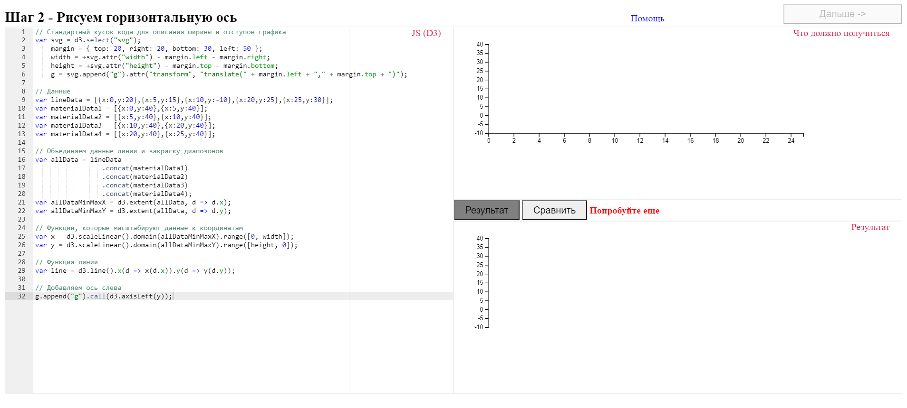
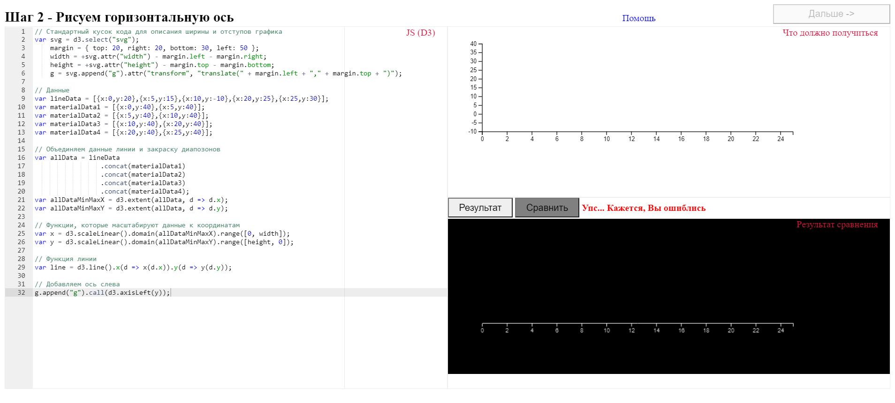

# Пример задания для проверки навыков владения D3.js с применением технологии сравнения пользовательского результат с эталонным изображением

## Реализация
- Создаем редактор JS кода (Ace)
- Создаем канвасы, "скриншотим" документы iframe'ов в эти канвасы (с помощью библиотеки rasterizeHTML)
- Сравниваем канвасы и получаем выходное изображение (с помощью библиотеки js-imagediff)
- Отрисовываем выходное изображение

## Интерфейс

Слева находится редактор js-кода. Справа сверху эталонный результат, а снизу текущий. На скриншотах ниже показан пример работы проверки результата.

_Правильные решения можно найти [здесь](lib/data/initials.js)_